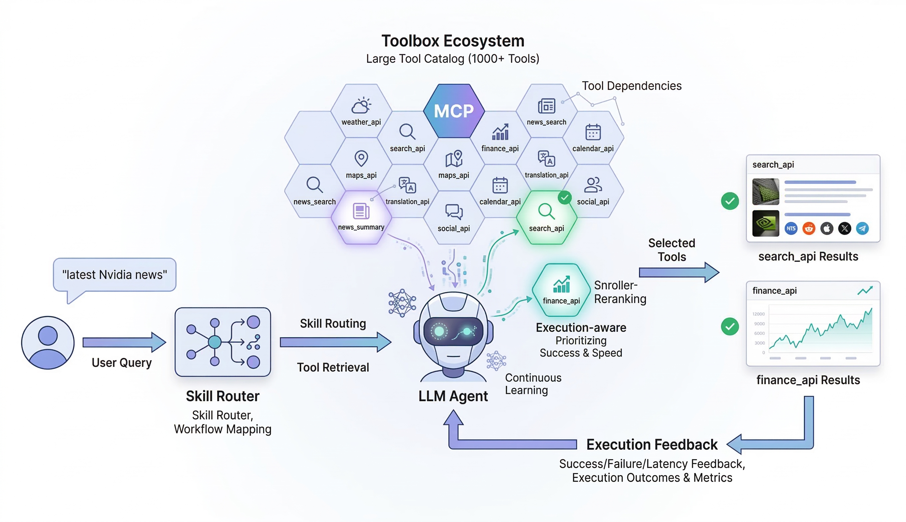

# ToolScout

> Execution-aware tool routing for LLM agents.


[简体中文](README.zh-CN.md)



LLM agents often need to work with hundreds or thousands of tools. Passing the full tool catalog into every prompt increases latency, wastes context, and makes tool selection less reliable. ToolScout retrieves and reranks tools using semantic similarity, skill routing, dependency expansion, and execution feedback so the agent only sees a compact, higher-quality shortlist.

## Quick Demo

From the repository root:

```bash
pip install -e .
toolscout search "latest Nvidia news"
```

Example output:

```text
Top tools:
1 news_search
2 web_search
3 finance_api
```

More quick commands:

```bash
toolscout search "weather in Tokyo" --execution-aware
toolscout skill "latest Nvidia news"
python examples/retrieval_demo.py
```

## Motivation

ToolScout is built for the failure modes that appear once agent systems stop being toy demos.

- `Tool explosion`: large internal or external tool catalogs do not fit cleanly into a single prompt.
- `Prompt pressure`: longer tool lists increase token cost and slow down planning.
- `Description mismatch`: tool metadata may look relevant even when a tool is flaky, slow, or poorly aligned with real execution success.

The key idea is simple: do not rank tools by semantics alone. ToolScout combines semantic retrieval with execution-aware reranking so the system can prefer tools that are both relevant and historically reliable.

## When to Use ToolScout

- **Enterprise Tools**: when your internal API catalog grows to hundreds of endpoints or more.
- **High-Stakes Tasks**: when picking the wrong tool, such as `delete_user` instead of `get_user`, is unacceptable.
- **Cost-Sensitive Apps**: when you want smaller or cheaper models to operate over a compact tool shortlist instead of a full catalog.

## Architecture Overview

```text
Query
  |
  v
Skill Router
  |
  v
Tool Retrieval
  |
  v
Execution-aware Reranking
  |
  v
Selected Tools
  |
  v
Agent Execution
  |
  v
Execution Feedback
```

What each stage does:

- `Skill Router`: maps the query to a higher-level workflow such as `news_research`.
- `Tool Retrieval`: pulls the strongest semantic candidates from the tool catalog.
- `Execution-aware Reranking`: blends semantic relevance with success rate and latency.
- `Selected Tools`: keeps the prompt small by passing only top candidates downstream.
- `Agent Execution`: lets the LLM plan and call tools on a reduced tool set.
- `Execution Feedback`: stores outcomes so future ranking can improve.

## Key Features

- Semantic tool retrieval over large tool libraries
- Skill-based routing before low-level tool search
- Tool dependency graph with graph-aware expansion
- Execution-aware reranking using success rate and latency
- MCP-compatible tool loading
- Offline evaluation framework with simulator-backed execution
- Scalable retrieval with FAISS or a lightweight NumPy fallback

## Installation

Clone the repository and install the lightweight default setup:

```bash
git clone https://github.com/Epsilon617/toolscout.git
cd toolscout
pip install -e .
```

Optional extras:

- `pip install -e .[embeddings]` for FAISS + sentence-transformers
- `pip install -e .[openai]` for the OpenAI demo and judge mode
- `pip install -e .[full]` for everything

Default installation is intentionally lightweight and uses the local NumPy + keyword fallback backend. If optional packages are unavailable, ToolScout still runs offline examples and benchmarks.

## Usage

### CLI

```bash
toolscout search "weather in Tokyo"
toolscout search "weather in Tokyo" --execution-aware
toolscout search "latest Nvidia news" --graph-aware
toolscout skill "latest Nvidia news"
toolscout simulate-runs --queries datasets/tool_queries.json --passes 5 --clear
toolscout feedback-stats
toolscout load-mcp path/to/mcp_tools.json
```

### Python

```python
from toolscout import ToolRegistry, ToolRetriever

registry = ToolRegistry()
registry.register_tool(
    name="weather_api",
    description="Get weather for a city",
    args=["city"],
)
registry.register_tool(
    name="news_search",
    description="Fetch recent news coverage for a topic or company",
    args=["topic"],
)

retriever = ToolRetriever(registry=registry)
retriever.fit()

results = retriever.search("latest Nvidia news", top_k=2)
for hit in results:
    print(hit.rank, hit.tool.name, round(hit.score, 4))
```

### More Examples

- `python examples/simple_agent.py --query "latest news about Nvidia"`
- `python examples/retrieval_demo.py`
- `python examples/langgraph_agent.py --query "summarize recent Nvidia articles"`
- `python examples/openai_agent_demo.py --model gpt-4.1-mini --query "latest news about Nvidia"`

## Evaluation

ToolScout evaluates tool routing at multiple layers rather than relying on retrieval metrics alone.

### Evaluation Layers

- `Retrieval Quality`: `Recall@k` and `Precision@1`
- `Decision Quality`: hard-negative benchmark with semantically confusing distractors
- `Execution Success`: end-to-end `Pass@1`, `Pass@k`, and simulated execution outcomes
- `Robustness`: schema mutation, tool sprawl scaling, and cross-lingual queries

Example offline summary from `python benchmark/generate_eval_report.py --top-k 5`:

| Method | Precision@1 | Pass@1 (Success) | Avg Latency |
| ------ | ----------: | ----------------: | ----------: |
| Random Retrieval | 0.417 | 0.000 | 133.289 ms |
| Semantic Retrieval | 0.833 | 0.750 | 117.555 ms |
| **ToolScout** | **1.000** | **0.917** | **111.454 ms** |

In this offline benchmark snapshot, ToolScout improves both task success and latency over pure semantic retrieval.

All evaluation scripts run offline by default:

- `python benchmark/hard_negative_eval.py --top-k 4`
- `python benchmark/judge_eval.py --judge-mode mock --top-k 5`
- `python benchmark/e2e_eval.py --top-k 5`
- `python benchmark/robustness_eval.py --top-k 5`
- `python benchmark/generate_eval_report.py --top-k 5`

`judge_eval.py` supports `openai` mode as an optional external judge, but the default offline path uses `mock` mode. End-to-end evaluation uses `ToolExecutionSimulator` when real APIs are unavailable.

## Evaluation Dataset

Evaluation dataset:

- 12 benchmark queries
- 1000-tool synthetic catalog
- 12 hard-negative cases
- 1 explicit multi-step tool chain: `news_search -> news_summary`
- 6 Chinese cross-lingual robustness queries

The datasets are intentionally lightweight so the full evaluation stack can run on a standard local Python environment.

Supported tool categories:

- `weather`
- `finance`
- `news`
- `maps`
- `math`
- `code`
- `translation`
- `search`
- `social`
- `calendar`

### Evaluation Flow

```text
Query
  |
  v
ToolScout Retrieval
  |
  v
Top-K Tools
  |
  v
Execution Simulator
  |
  v
Success / Failure Logging
  |
  v
Execution-aware Ranking Update
```

This loop lets ToolScout move beyond one-shot retrieval metrics and measure whether the selected tool actually succeeds.

## Repository Structure

```text
toolscout/    core library, CLI, registries, retrieval, graph, feedback
benchmark/    retrieval, decision, execution, and robustness evaluation
datasets/     synthetic tools, skills, query sets, and hard negatives
examples/     simple agent, retrieval demo, LangGraph demo, OpenAI demo
assets/       README images
```

## Contributing

Contributions are welcome.

- Fork the repository
- Create a feature branch
- Run the offline examples or benchmarks relevant to your change
- Open a pull request with a clear summary of the behavior change

## Roadmap

- Larger and more diverse benchmark datasets
- Better learning from execution feedback
- Real API execution benchmarks
- Deeper integration with agent runtimes such as LangGraph and MCP ecosystems

## License

MIT
